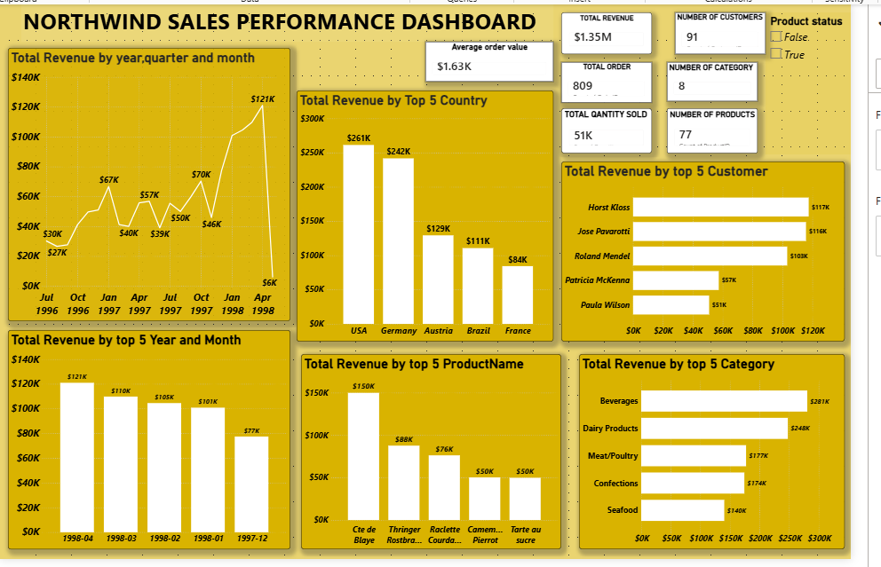
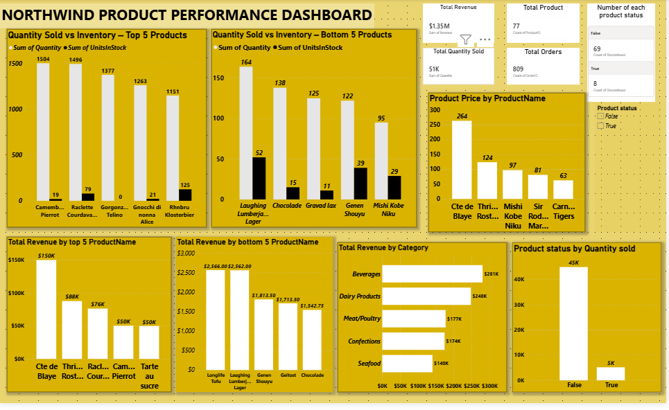
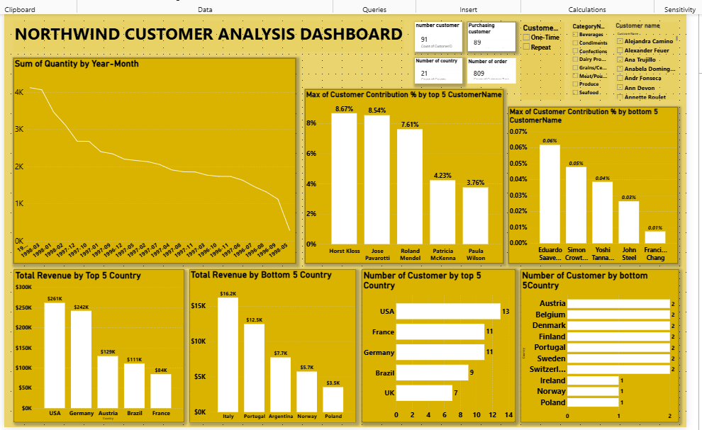
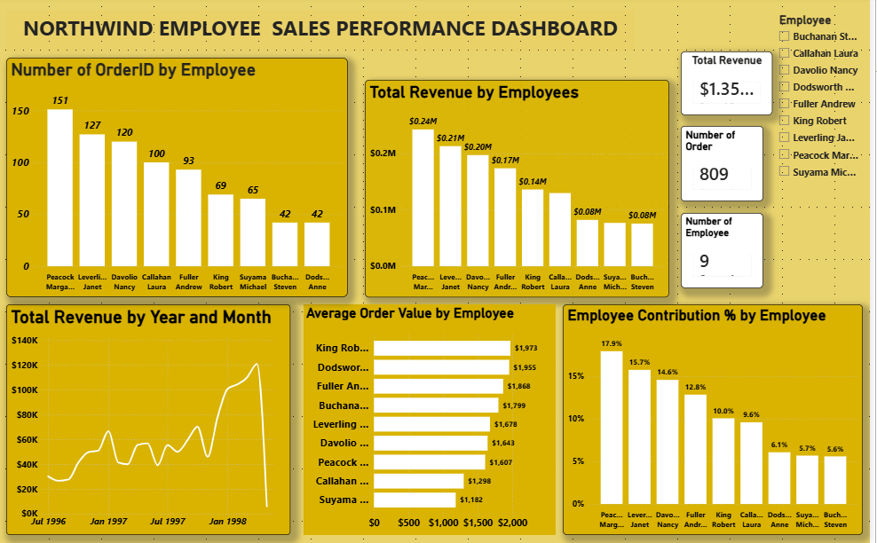
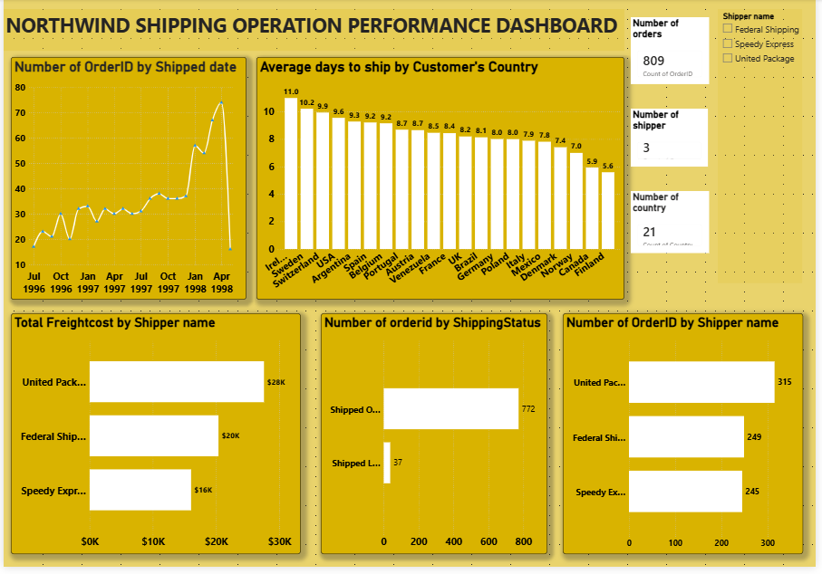

# Northwind Business Performance Analysis

## Project Overview

This project is a **Business Intelligence and Data Analytics project** built with **Microsoft Power BI** using the Northwind business database.

The objective of the project is to transform business transaction data into interactive dashboards that support the analysis of sales, products, customers, employees, categories, and shipping operations.

The analysis covers:

- Sales performance and revenue trends
- Sales by country and category
- Product performance and quantity
- Customer distribution and performance
- Employee sales performance
- Category performance
- Shipping and freight performance
- Dispatch and operational performance
- Business insights and recommendations

The project includes an interactive Power BI report, supporting analysis pages, dashboard screenshots, a PDF report, presentation, database, and data model documentation.

## Quick Access

- 📊 [View Power BI Report](powerbi/)
- 📄 [View PDF Report](pdf/)
- 🎤 [View CEO Presentation](presentation/)
- 🗄️ [View Northwind Database](data/)
- 🖼️ [View Dashboard Screenshots](images/)
- 🗂️ [View Data Model](documentation/)

---

## Business Problem

Businesses generate large amounts of transactional data, but raw data can be difficult to interpret and use for decision-making.

This project uses the Northwind business database to analyze key areas of business performance, including:

- Overall sales performance
- Sales trends over time
- Product performance
- Customer contribution and purchasing activity
- Employee sales performance
- Category performance
- Shipping and freight performance
- Operational performance

Interactive Power BI dashboards make these areas easier to monitor, compare, and analyze.

---

## Project Objectives

The main objectives of this project are to:

- Analyze overall business performance.
- Identify sales trends over time.
- Analyze revenue by country.
- Analyze sales by category.
- Evaluate product performance.
- Analyze product quantity and inventory.
- Analyze customer distribution and customer performance.
- Evaluate employee sales performance.
- Analyze category performance.
- Analyze shipper and freight performance.
- Analyze dispatch and shipping performance.
- Develop business insights and recommendations.

---

## Dataset Description

The project uses the **Northwind sample business database**.

The database contains business transaction and operational information relating to areas such as customers, orders, products, employees, categories, suppliers, and shipping.

The database used in the project is:

`Northwind.db`

The Power BI report was built using the Northwind database as its source data.

---

## Database Structure

The project uses the following major Northwind business entities:

| Table | Description |
|---|---|
| **Orders** | Contains order-level transaction information |
| **Order Details** | Contains details of products included in orders |
| **Customers** | Contains customer information |
| **Products** | Contains product information |
| **Categories** | Contains product category information |
| **Employees** | Contains employee information |
| **Shippers** | Contains shipping information |
| **Suppliers** | Contains supplier information |

These business entities support analysis across sales, products, customers, employees, categories, and shipping operations.

> The project documentation focuses on the tables and model used in the Power BI analysis without assuming relationships that are not verified.

---

## Tools & Technologies

The project uses the following tools and technologies:

### Power BI
Used to build the interactive dashboards, visualizations, analysis pages, and business report.

### Power Query
Used for data preparation and transformation before analysis.

### DAX
Used for calculations and analytical measures within Power BI.

### SQLite
Used as the database technology for the Northwind source database.

### ODBC
Used to connect the SQLite database to Power BI.

### Northwind Database
Used as the source business dataset for the analysis.

---

## Data Preparation

The data preparation process included reviewing and preparing the Northwind source data for analysis in Power BI.

Activities included:

- Loading the Northwind database into Power BI.
- Reviewing source tables.
- Checking and preparing data types.
- Preparing date fields for time-based analysis.
- Creating Year and Month fields where applicable.
- Preparing fields for analysis and visualization.
- Identifying records requiring attention during analysis.
- Preparing the data model for Power BI reporting.

The transformations documented here are limited to activities supported by the project.

---

## Data Model

The Power BI project uses the Northwind business tables to support analysis across sales, products, customers, employees, categories, and shipping operations.

The model brings together transactional and descriptive business information to enable interactive analysis across different areas of the business.

### Data Model

[View Data Model](documentation/data-model.png)

---

## Analysis Performed

### 1. Executive Business Analysis

The project includes an **Executive Overview** and an **Executive Business Insights & Recommendations** page.

These pages provide a high-level view of business performance and summarize areas that require management attention.

The executive analysis is designed to help decision-makers quickly understand the information presented across the detailed dashboards.

---

### 2. Sales Performance Analysis

Sales performance was analyzed using the following report pages:

- Sales Trend
- Sales by Category & Product Quantity
- Sales by Country
- Sales by Year/Month
- Northwind Sales Performance Dashboard

The analysis addresses questions such as:

- How does sales performance change over time?
- Which countries generate revenue?
- How do product categories perform?
- Which periods show higher or lower revenue?
- What are the major sales trends?

The analysis includes both time-based and geographic views of sales performance.

---

### 3. Product Performance Analysis

Product performance was analyzed using:

- Top Product
- Top Product & Product Sales
- Northwind Product Performance Dashboard

The analysis covers:

- Product sales
- Product quantity
- Product revenue
- Product pricing
- Inventory
- Product status
- Top-performing products
- Low-performing products

The analysis also considers product status, including discontinued products, to support product-level business decisions.

---

### 4. Customer Analysis

Customer performance was analyzed using:

- Customer Distribution
- Top Customers
- Customers Performance
- Northwind Customer Analysis Dashboard

The analysis covers:

- Customer distribution
- Customer purchasing activity
- Customer revenue contribution
- Customer performance
- Customer purchasing patterns
- Geographic customer distribution

These views provide a way to examine how customers contribute to overall business activity.

---

### 5. Employee Performance Analysis

Employee performance was analyzed using:

- Employees Performance
- Northwind Employee Sales Performance Dashboard

The analysis includes:

- Revenue by employee
- Orders handled
- Average Order Value
- Revenue contribution
- Employee performance over time

Employee performance is considered using multiple metrics rather than interpreting revenue alone as a complete measure of productivity.

---

### 6. Category Analysis

The project includes a dedicated **Category Performance** analysis.

This analysis examines:

- Category revenue
- Category sales performance
- Product and category comparisons
- Differences between categories

This provides a category-level view of business performance.

---

### 7. Shipping & Operational Analysis

Shipping and operational performance was analyzed using:

- Shippers Freight Performance
- Dispatch Performance
- Northwind Shipping Operation Performance Dashboard

The analysis covers areas such as:

- Orders by shipper
- Freight costs
- Shipping activity
- Shipping status
- Shipped dates
- Average days to ship where applicable
- Performance by country
- Dispatch performance

These views provide insight into the operational side of order fulfillment and shipping.

---

## Dashboard Preview

The Power BI project contains five major interactive dashboards.

### Sales Performance Dashboard



This dashboard presents the main sales performance analysis, including sales trends and geographic/category perspectives.

---

### Product Performance Dashboard



This dashboard focuses on product sales, quantity, product performance, pricing, inventory, and product status.

---

### Customer Analysis Dashboard



This dashboard presents customer distribution, purchasing activity, customer contribution, and customer performance.

---

### Employee Sales Performance Dashboard



This dashboard analyzes employee sales performance using metrics such as revenue, orders, contribution, and Average Order Value.

---

### Shipping Operations Dashboard



This dashboard focuses on shipping activity, freight performance, shipping status, and dispatch operations.

---

## Key Insights

The Power BI analysis provides business insights across several areas.

### Sales

The report provides multiple views of sales performance across time, countries, categories, and products.

### Products

Product-level analysis makes it possible to examine sales, quantity, pricing, inventory, and product status.

### Customers

Customer analysis provides visibility into customer distribution, purchasing activity, and contribution to business performance.

### Employees

Employee analysis provides multiple performance measures that can be used together when evaluating sales activity.

### Shipping

Shipping and operational analysis provides visibility into freight costs, shipping activity, shippers, and dispatch performance.

### Business Performance

The executive analysis brings these areas together to support a broader understanding of business performance.

> Exact numerical findings and rankings are intentionally not included here unless they can be directly verified from the project files.

---

## Recommendations

The analysis can support practical business decisions in the following areas:

### Product Strategy
Use product and category performance analysis to identify products requiring further review, promotion, monitoring, or inventory attention.

### Customer Strategy
Use customer performance and purchasing activity to identify opportunities for customer engagement and retention.

### Sales Strategy
Use sales trends, country performance, category performance, and product performance to support sales planning.

### Inventory Management
Use product quantity, inventory, and product performance information to support inventory decisions.

### Employee Performance Management
Evaluate employee performance using multiple indicators rather than relying on a single sales metric.

### Shipping & Operations
Use freight, shipper, shipping-status, and dispatch analysis to identify areas where operational processes may require attention.

These recommendations should be interpreted alongside the detailed Power BI analysis and the underlying data.

---

## Data Quality & Limitations

The project includes a dedicated page called:

`Revenue Generated Without Record`

This analysis identifies records that require attention when interpreting revenue and time-based analysis.

In particular, incomplete records can affect analyses that depend on fields such as order dates.

Therefore, results involving time-based analysis should be interpreted with awareness of records that do not contain complete information.

The project documentation does not assume that missing or incomplete records should simply be removed; instead, the affected records are highlighted for further investigation.

---

## Project Structure

```text
northwind-business-performance-analysis/
│
├── README.md
│
├── data/
│   └── Northwind.db
│
├── powerbi/
│   └── Northwind Business Performance Analysis.pbix
│
├── pdf/
│   └── Northwind_Report.pdf
│
├── presentation/
│   └── Northwind Business Performance Analysis.pptx
│
├── images/
│   ├── customer-analysis.png
│   ├── employee-performance.png
│   ├── product-performance.png
│   ├── sales-performance.png
│   └── shipping-operations.png
│
└── documentation/
    └── data-model.png
